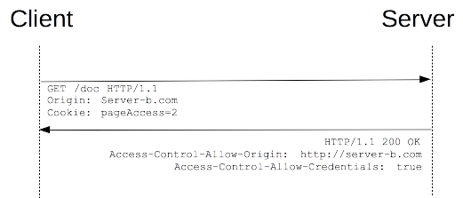

# 超文本传输协议（HTTP）

> HTTP 超文本传输协议（Hypertext Transfer Protocol or HTTP）是一个用于 分布式的，协作的，超媒体信息系统的应用层协议。HTTP 是万维网数据通信的基础。[以上解释引用自维基百科](https://en.wikipedia.org/wiki/Hypertext_Transfer_Protocol)
> CORS 跨域资源共享（Cross-origin resource sharing or CORS）是一个允许一个网页上的被限制的资源（例如，网络字体）能够从其他域名源网站里被请求到的一种机制。[以上解释引用自维基百科](https://en.wikipedia.org/wiki/Cross-origin_resource_sharing)
> WebSocket 是一个在单个 TCP 连接上提供全双工通信渠道的协议。WebSocket协议在2011年被 IETF （国际互联网工程任务组The Internet Engineering Task Force）由 文件 RFC 6455 实现标准化，由 W3C 由网络 IDL 实现接口标准化。[以上解释引用自维基百科](https://en.wikipedia.org/wiki/WebSocket)

## HTTP

### 概述

HTTP 协议是什么？HTTP协议是定义了客户端（浏览器）如何通过网络获取服务端（服务器）上的资源和文件的协议。也就是客户端（浏览器）向服务端（服务器）发出一个请求（request），然后服务器接收到请求后返回一个响应（response）。

#### HTTP 协议中的组成部分

* 客户端：发送请求的实体，一般是浏览器。
* 服务端：接收请求并返回响应的实体，一般是服务器，或者是一组服务器组成的服务器群。
* 代理：客户端和服务端之间有很多代理，这些代理的作用有缓存，过滤，负载均衡，认证，日志记录。

#### HTTP 协议的特点

HTTP 协议是无状态的。

**在同一个连接中，两个执行成功的请求之间是没有关系的。**这就带来了一个问题，用户没有办法在同一个网站中进行连续的交互，比如在一个电商网站里，用户把某个商品加入到购物车，切换一个页面后再次添加了商品，这两次添加商品的请求之间没有关联，浏览器无法知道用户最终选择了哪些商品。而使用HTTP的头部扩展，HTTP Cookies就可以解决这个问题。把Cookies添加到头部中，创建一个会话让每次请求都能共享相同的上下文信息，达成相同的状态。注意，HTTP本质是无状态的，使用Cookies可以创建有状态的会话。

HTTP 协议是应用层协议。

HTTP 属于网络分层中的应用层协议。而一个网络连接是依靠传输层来控制的。传输层的 TCP 协议就相当于一条管道，而 HTTP 协议就负责定义在管道中传输的数据格式是什么样子的。

#### HTTP 请求的过程

1. **建立TCP连接**：在 HTTP 工作开始之前，Web 浏览器首先要通过网络与 Web 服务器建立连接，该连接是通过 TCP 来完成的，该协议与 IP 协议共同构建 Internet，即著名的 TCP/IP 协议族，因此 Internet 又被称作是 TCP/IP 网络。HTTP 是比 TCP 更高层次的应用层协议，根据规则， 只有低层协议建立之后才能，才能进行更层协议的连接，因此，首先要建立 TCP 连接，一般 TCP 连接的端口号是80。
2. **Web浏览器向Web服务器发送请求命令**：一旦建立了 TCP 连接，Web 浏览器就会向 Web 服务器发送请求命令。例如：GET/sample/hello.jsp HTTP/1.1。
3. **Web浏览器发送请求头信息**：浏览器发送其请求命令之后，还要以头信息的形式向 Web 服务器发送一些别的信息，之后浏览器发送了一空白行来通知服务器，它已经结束了该头信息的发送。
4. **Web服务器应答**：客户机向服务器发出请求后，服务器会客户机回送应答， HTTP/1.1 200 OK ，应答的第一部分是协议的版本号和应答状态码。
5. **Web服务器发送应答头信息**：正如客户端会随同请求发送关于自身的信息一样，服务器也会随同应答向用户发送关于它自己的数据及被请求的文档。
6. **Web服务器向浏览器发送数据**：Web 服务器向浏览器发送头信息后，它会发送一个空白行来表示头信息的发送到此为结束，接着，它就以 Content-Type 应答头信息所描述的格式发送用户所请求的实际数据。
7. **Web服务器关闭TCP连接**：一般情况下，一旦 Web 服务器向浏览器发送了请求数据，它就要关闭 TCP 连接，然后如果浏览器或者服务器在其头信息加入了这行代码：Connection:keep-alive。TCP 连接在发送后将仍然保持打开状态，于是，浏览器可以继续通过相同的连接发送请求。保持连接节省了为每个请求建立新连接所需的时间，还节约了网络带宽。

#### HTTP 报文

HTTP/1.1 以及更早的 HTTP 协议报文都是语义可读的。在 HTTP/2 中，这些报文被嵌入到了一个新的二进制结构，帧。帧允许实现很多优化，比如报文头部的压缩和复用。

有两种 HTTP 报文的类型，请求与响应，每种都有其特定的格式。

<p align="center">
  
</p>
<p align="center"><span>HTTP 报文</span></p>

从上面图中可以看到，报文都由三部分组成：起始行（Request line or Status line），首部（Headers），主体（body）。

1. **起始行**：所有的 HTTP 报文都以一个起始行作为开始。请求报文的起始行说明了要做些什么。响应报文的起始行说明发生了什么。

    请求报文的起始行：该行包含了一个方法和一个请求的 URL，还包含 HTTP 的版本。

    响应报文的起始行：该行包含了响应报文使用的 HTTP 版本、数字状态码、原因短语。

2. **头部**：报文的头部向请求和响应报文中添加了一些附加信息。本质上来说，它们只是一些名/值对的列表。头部和协议配合工作，共同决定了客户端和服务器能做什么事情。头部的种类非常多，这里就不写例子了。头部也可以自定义。有关请求头部的详细讲解和分类看[MDN的文档](https://developer.mozilla.org/zh-CN/docs/Web/HTTP/Headers)。

3. **实体的主体部分**：该部分其实就是 HTTP 要传输的内容，是可选的。HTTP 报文可以承载很多类型的数字数据，比如，图片、视频、HTML 文档电子邮件、软件应用程序等等。

#### HTTP 头部（也称为 HTTP 首部字段，）

HTTP 消息头允许客户端和服务器通过 request 和 response 传递附加信息。一个请求头由名称（不区分大小写）后跟一个冒号“：”，冒号后跟具体的值（不带换行符）组成。该值前面的引导空白会被忽略。

根据不同上下文，可将消息头分为：

* 一般头: 同时适用于请求和响应消息，但与最终消息主体中传输的数据无关的消息头。
* 请求头: 包含更多有关要获取的资源或客户端本身信息的消息头。
* 响应头: 包含有关响应的补充信息，如其位置或服务器本身（名称和版本等）的消息头。
* 实体头: 包含有关实体主体的更多信息，比如主体长(Content-Length)度或其MIME类型。

下面是一个请求头的例子：

```
Accept: application/json, text/plain, */*
Accept-Encoding: gzip, deflate, br
Accept-Language: zh-CN,zh;q=0.9
Connection: keep-alive
Content-Length: 2
Content-Type: application/json;charset=UTF-8
Cookie: _ga=GA1.1.1821137291.1548063854
Host: localhost:3005
Origin: http://localhost:3005
Referer: http://localhost:3005/
User-Agent: Mozilla/5.0 (Windows NT 10.0; Win64; x64) AppleWebKit/537.36 (KHTML, like Gecko) Chrome/71.0.3578.98 Safari/537.36
```

HTTP Headers 种类特别多，请查看 MDN 文档寻找详细信息[HTTP Headers MDN](https://developer.mozilla.org/zh-CN/docs/Web/HTTP/Headers)。

## CORS

CORS（Cross-Origin Resource Sharing）是跨域资源共享的意思，要理解它的含义，就要从浏览器的同源策略说起。

### 浏览器的同源策略

同源策略限制了从同一个源加载的文档或脚本如何与来自另一个源的资源进行交互。这是一个用于隔离潜在恶意文件的重要安全机制。

换句简单的话说，就是页面请求的资源必须和页面所在的“源”一样，否则就会失败。

那么，“源”是什么？

#### 同源的定义

**如果两个页面的协议，端口（如果有指定）和域名都相同，则两个页面具有相同的源。**

下表给出了相对`http://store.company.com/dir/page.html`同源检测的示例：

<table>
  <tr>
    <th>URL</th>
    <th>结果</th>
    <th>原因</th>
  </tr>
  <tr>
    <td>http://store.company.com/dir2/other.html</td>
    <td>成功</td>
    <td></td>
  </tr>
  <tr>
    <td>http://store.company.com/dir/inner/another.html</td>
    <td>成功</td>
    <td></td>
  </tr>
  <tr>
    <td>https://store.company.com/secure.html</td>
    <td>失败</td>
    <td>不同协议 ( https和http )</td>
  </tr>
  <tr>
    <td>http://store.company.com:81/dir/etc.html</td>
    <td>失败</td>
    <td>不同端口 ( 81和80)</td>
  </tr>
  <tr>
    <td>http://news.company.com/dir/other.html</td>
    <td>失败</td>
    <td>不同域名 ( news和store )</td>
  </tr>
</table>

#### 源的更改

通过改变`document.domain`可以使得子域和父域之间互相通信。

脚本可以将 `document.domain` 的值设置为其当前域或其当前域的父域。如果将其设置为其当前域的父域，则较短的域将用于后续源检查。假设 `http://store.company.com/dir/other.html` 文档中的一个脚本执行以下语句：

```js
document.domain = "company.com";
```

这条语句执行之后，页面将会成功地通过对 `http://company.com/dir/page.html` 的同源检测（假设`http://company.com/dir/page.html` 将其 `document.domain` 设置为`company.com`，以表明它希望允许这样做）。然而，`company.com` 不能设置 `document.domain` 为 `othercompany.com`，因为它不是 `company.com` 的父域。

浏览器单独保存端口号。任何的赋值操作，包括 `document.domain = document.domain` 都会导致端口号被重写为 null 。因此 `company.com:8080` 不能仅通过设置 `document.domain = "company.com"` 来与`company.com`通信。必须在他们双方中都进行赋值，以确保端口号都为 null 。

注意：使用 `document.domain` 来允许子域安全访问其父域时，您需要在父域和子域中设置 `document.domain` 为相同的值。这是必要的，即使这样做只是将父域设置回其原始值。不这样做可能会导致权限错误。

#### 跨源网络访问

同源策略控制了不同源之间的交互。这些交互通常分为三类：

* 通常允许跨域写操作（Cross-origin writes）。例如链接（links），重定向以及表单提交。
* 通常允许跨域资源嵌入（Cross-origin embedding）。之后下面会举例说明。
* 通常**不允许**跨域读操作（Cross-origin reads）。但常可以通过内嵌资源来巧妙的进行读取访问。例如可以读取嵌入图片的高度和宽度，调用内嵌脚本的方法。

以下是可能嵌入跨源的资源的一些示例：

* `<script src="..."></script>` 标签嵌入跨域脚本。语法错误信息只能在同源脚本中捕捉到。
* `<link rel="stylesheet" href="...">` 标签嵌入CSS。由于CSS的松散的语法规则，CSS的跨域需要一个设置正确的Content-Type 消息头。不同浏览器有不同的限制。
* ``嵌入图片。支持的图片格式包括PNG,JPEG,GIF,BMP,SVG,...
* `<video>` 和 `<audio>`嵌入多媒体资源。
* `<object>`, `<embed>` 和 `<applet>` 的插件。
* `@font-face` 引入的字体。一些浏览器允许跨域字体（ cross-origin fonts），一些需要同源字体（same-origin fonts）。
* `<frame>` 和 `<iframe>` 载入的任何资源。站点可以使用X-Frame-Options消息头来阻止这种形式的跨域交互。

总之，涉及到页面中要加载不同源的资源而且被浏览器阻止的时候，就需要跨域来获取这些资源，就需要使用跨域资源共享（CORS）。

### 跨域资源共享（CORS）

跨域资源共享(CORS) 是一种机制，它使用额外的 HTTP 头来告诉浏览器  让运行在一个 origin (domain) 上的Web应用被准许访问来自不同源服务器上的指定的资源。当一个资源从与该资源本身所在的服务器不同的域、协议或端口请求一个资源时，资源会发起一个跨域 HTTP 请求。

比如，站点 `http://domain-a.com` 的某 HTML 页面通过  的 src 请求 `http://domain-b.com/image.jpg`。网络上的许多页面都会加载来自不同域的CSS样式表，图像和脚本等资源。

出于安全原因，浏览器限制从脚本内发起的跨源HTTP请求。 例如，XMLHttpRequest和Fetch API遵循同源策略。 这意味着使用这些API的Web应用程序只能从加载应用程序的同一个域请求HTTP资源，除非响应报文包含了正确CORS响应头。

什么情况下需要使用 CORS？

* 前文提到的由 XMLHttpRequest 或 Fetch 发起的跨域 HTTP 请求。
* Web 字体 (CSS 中通过 @font-face 使用跨域字体资源), 因此，网站就可以发布 TrueType 字体资源，并只允许已授权网站进行跨站调用。
* WebGL 贴图
* 使用 drawImage 将 Images/video 画面绘制到 canvas
* 样式表（使用 CSSOM）

#### 功能概述

跨域资源共享标准新增了一组 HTTP 头部，允许服务器声明哪些源站通过浏览器有权限访问哪些资源。另外，规范要求，对那些可能对服务器数据产生副作用的 HTTP 请求方法（特别是 GET 以外的 HTTP 请求，或者搭配某些 MIME 类型的 POST 请求），浏览器必须首先使用 OPTIONS 方法发起一个预检请求（preflight request），从而获知服务端是否允许该跨域请求。服务器确认允许之后，才发起实际的 HTTP 请求。在预检请求的返回中，服务器端也可以通知客户端，是否需要携带身份凭证（包括 Cookies 和 HTTP 认证相关数据）。

CORS请求失败会产生错误，但是为了安全，在JavaScript代码层面是无法获知到底具体是哪里出了问题。你只能查看浏览器的控制台以得知具体是哪里出现了错误。

#### CORS 示例

本示例请查看[这里的源代码](../example/HTTP/CORS)。

下面使用一个例子来解释 CORS 的工作原理。这个例子使用 XMLHttpRequest 对象。

```html
<!DOCTYPE html>
<html lang="en">
<head>
  <meta charset="UTF-8">
  <meta name="viewport" content="width=device-width, initial-scale=1.0">
  <meta http-equiv="X-UA-Compatible" content="ie=edge">
  <title>Document</title>
  <style>
    .box {
      padding: 30px;
    }
  </style>
</head>
<body>
  <div class="box">
    <button class="btn1">点击按钮发送跨域请求 跨域请求会成功</button>
    <button class="btn2">点击按钮发送跨域请求2 跨域请求会失败</button>
  </div>
</body>
<script src="axios.min.js"></script>
<script>
  var btn = document.querySelector('.btn1')
  var btn2 = document.querySelector('.btn2')

  btn.addEventListener('click', () => {
    console.log('点击按钮发送跨域请求！')
    
    axios.post('http://localhost:3000/getSomeData', {}).then((response) => {
      console.log(response, 'response')
    }).catch((err) => {
      console.log(err, 'err')
    })
  }, false)

  btn2.addEventListener('click', () => {
    console.log('点击按钮发送跨域请求！')
    
    axios.post('http://localhost:3000/getSomeData2', {}).then((response) => {
      console.log(response, 'response')
    }).catch((err) => {
      console.log(err, 'err')
    })
  }, false)
</script>
</html>
```

下面是后台代码：

```js
const express = require('express')
const bodyParser = require('body-parser')
const morgan = require('morgan')

const app = express()
const router = express.Router()

app.use(bodyParser.json())
app.use(morgan('combined'))

router.all('/getSomeData', (req, res, next) => {
  //为路径为/getSomeData的请求设置允许跨域的请求头
  res.header('Access-Control-Allow-Origin', '*')
  res.header('Access-Control-Allow-Methods', 'POST')
  res.header('Access-Control-Allow-Headers', 'Content-Type')
  next()
})

router.post('/getSomeData', (req, res) => {
  //url为/getSomeData设置了跨域请求头，因此跨域请求会成功
  console.log('接收到请求！！\n')

  return res.json({
    name: 'zzx',
    number: 1
  })
})

router.post('/getSomeData2', (req, res) => {
  //url为/getSomeData2没有设置跨域请求头，因此跨域请求会失败
  console.log('接收到请求！！\n')

  return res.json({
    name: 'zzx',
    number: 2
  })
})

app.use('/', router)

app.listen(3000, () => {
  console.log(`Express server listening on port 3000 with pid ${process.pid}`)
})
```

#### 预检请求

上面的例子运行后会发现一个奇怪的现象：

跨域成功的那个请求发送了两次，第一次是一个 OPTIONS 请求，第二次才是真正的 POST 请求。

这个 OPTIONS 请求就是预检请求（preflighted request）。

##### 什么时候会发起预检请求？

当前请求涉及**跨域**，并且当前请求**不是一个简单请求**的时候，就会发起预检请求。

##### 简单请求 和 非简单请求

若请求满足所有下述条件，则该请求可视为**简单请求**：

* 使用下列方法之一：GET  HEAD  POST
* 必须是下面定义对 CORS 安全的首部字段集合，不能是集合之外的其他首部字段：
  Accept  Accept-Language  Content-Language  DPR  Downlink  Save-Data  Viewport-Width  Width Content-Type （Content-Type需要注意额外的限制）
* Content-Type 的值仅限于下列三者之一：
  text/plain  multipart/form-data  application/x-www-form-urlencoded

当请求满足下述任一条件时，则是**非简单请求**，即应首先发送**预检请求**：

* 使用了下面任一 HTTP 方法： PUT  DELETE  CONNECT  OPTIONS  TRACE  PATCH
* 设置了对 CORS 安全的首部字段集合**之外的**其他首部字段。该集合为：
  Accept  Accept-Language  Content-Language  Content-Type (but note the additional requirements below)  DPR  Downlink  Save-Data  Viewport-Width  Width
* Content-Type 的值不属于下列之一:
  application/x-www-form-urlencoded  multipart/form-data  text/plain

通过这样的对比原因就清除了，我们上面的例子里面的发送的跨域请求拥有 安全首部字段 之外的其他字段，比如 Accept 字段，并且 Content-Type 的值为 Content-Type: application/json。

**因此例子中的请求不是简单请求，又因为处于跨域请求的状态下，所以会先发送 OPTIONS 预检请求判断后台程序是否设置了跨域头部。**

**注意：**对于附带身份凭证的请求(即服务器设置Access-Control-Allow-Credentials: true)，服务器不得设置Access-Control-Allow-Origin 的值为“*”。否则请求将会失败。必须设置为具体的域名才能生效。

#### 简单请求，非简单请求，带身份凭证的请求使用 CORS 图例

<p align="center">
  
</p>
<p align="center"><span>简单请求 CORS</span></p>

<p align="center">
  
</p>
<p align="center"><span>非简单请求 CORS 会先发起 预检请求</span></p>

<p align="center">
  
</p>
<p align="center"><span>带身份凭证的请求 CORS</span></p>

## WebSocket

## 参考文献

* [CORS MDN](https://developer.mozilla.org/zh-CN/docs/Web/HTTP/Access_control_CORS)
* [HTTP Headers MDN](https://developer.mozilla.org/zh-CN/docs/Web/HTTP/Headers)
* [HTTP Documentation](https://httpwg.org/specs/)