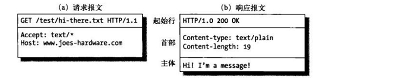

# 超文本传输协议（HTTP）

> HTTP 超文本传输协议（Hypertext Transfer Protocol or HTTP）是一个用于 分布式的，协作的，超媒体信息系统的应用层协议。HTTP 是万维网数据通信的基础。[以上解释引用自维基百科](https://en.wikipedia.org/wiki/Hypertext_Transfer_Protocol)
> CORS 跨域资源共享（Cross-origin resource sharing or CORS）是一个允许一个网页上的被限制的资源（例如，网络字体）能够从其他域名源网站里被请求到的一种机制。[以上解释引用自维基百科](https://en.wikipedia.org/wiki/Cross-origin_resource_sharing)
> WebSocket 是一个在单个 TCP 连接上提供全双工通信渠道的协议。WebSocket协议在2011年被 IETF （国际互联网工程任务组The Internet Engineering Task Force）由 文件 RFC 6455 实现标准化，由 W3C 由网络 IDL 实现接口标准化。[以上解释引用自维基百科](https://en.wikipedia.org/wiki/WebSocket)

## HTTP

### 概述

HTTP 协议是什么？HTTP协议是定义了客户端（浏览器）如何通过网络获取服务端（服务器）上的资源和文件的协议。也就是客户端（浏览器）向服务端（服务器）发出一个请求（request），然后服务器接收到请求后返回一个响应（response）。

#### HTTP 协议中的组成部分

* 客户端：发送请求的实体，一般是浏览器。
* 服务端：接收请求并返回响应的实体，一般是服务器，或者是一组服务器组成的服务器群。
* 代理：客户端和服务端之间有很多代理，这些代理的作用有缓存，过滤，负载均衡，认证，日志记录。

#### HTTP 协议的特点

HTTP 协议是无状态的。

**在同一个连接中，两个执行成功的请求之间是没有关系的。**这就带来了一个问题，用户没有办法在同一个网站中进行连续的交互，比如在一个电商网站里，用户把某个商品加入到购物车，切换一个页面后再次添加了商品，这两次添加商品的请求之间没有关联，浏览器无法知道用户最终选择了哪些商品。而使用HTTP的头部扩展，HTTP Cookies就可以解决这个问题。把Cookies添加到头部中，创建一个会话让每次请求都能共享相同的上下文信息，达成相同的状态。注意，HTTP本质是无状态的，使用Cookies可以创建有状态的会话。

HTTP 协议是应用层协议。

HTTP 属于网络分层中的应用层协议。而一个网络连接是依靠传输层来控制的。传输层的 TCP 协议就相当于一条管道，而 HTTP 协议就负责定义在管道中传输的数据格式是什么样子的。

#### HTTP 请求的过程

1. **建立TCP连接**：在HTTP工作开始之前，Web浏览器首先要通过网络与Web服务器建立连接，该连接是通过TCP来完成的，该协议与IP协议共同构建 Internet，即著名的TCP/IP协议族，因此Internet又被称作是TCP/IP网络。HTTP是比TCP更高层次的应用层协议，根据规则， 只有低层协议建立之后才能，才能进行更层协议的连接，因此，首先要建立TCP连接，一般TCP连接的端口号是80。
2. **Web浏览器向Web服务器发送请求命令**：一旦建立了TCP连接，Web浏览器就会向Web服务器发送请求命令。例如：GET/sample/hello.jsp HTTP/1.1。
3. **Web浏览器发送请求头信息**：浏览器发送其请求命令之后，还要以头信息的形式向Web服务器发送一些别的信息，之后浏览器发送了一空白行来通知服务器，它已经结束了该头信息的发送。
4. **Web服务器应答**：客户机向服务器发出请求后，服务器会客户机回送应答， HTTP/1.1 200 OK ，应答的第一部分是协议的版本号和应答状态码。
5. **Web服务器发送应答头信息**：正如客户端会随同请求发送关于自身的信息一样，服务器也会随同应答向用户发送关于它自己的数据及被请求的文档。
6. **Web服务器向浏览器发送数据**：Web服务器向浏览器发送头信息后，它会发送一个空白行来表示头信息的发送到此为结束，接着，它就以Content-Type应答头信息所描述的格式发送用户所请求的实际数据。
7. **Web服务器关闭TCP连接**：一般情况下，一旦Web服务器向浏览器发送了请求数据，它就要关闭TCP连接，然后如果浏览器或者服务器在其头信息加入了这行代码：Connection:keep-alive。TCP连接在发送后将仍然保持打开状态，于是，浏览器可以继续通过相同的连接发送请求。保持连接节省了为每个请求建立新连接所需的时间，还节约了网络带宽。

#### HTTP 报文

HTTP/1.1以及更早的HTTP协议报文都是语义可读的。在HTTP/2中，这些报文被嵌入到了一个新的二进制结构，帧。帧允许实现很多优化，比如报文头部的压缩和复用。

有两种HTTP报文的类型，请求与响应，每种都有其特定的格式。

  

HTTP 报文

从上面图中可以看到，报文都由三部分组成：起始行（Request line or Status line），首部（Headers），主体（body）。

1. **起始行**：所有的HTTP报文都以一个起始行作为开始。请求报文的起始行说明了要做些什么。响应报文的起始行说明发生了什么。

    请求报文的起始行：该行包含了一个方法和一个请求的URL，还包含HTTP 的版本。

    响应报文的起始行：该行包含了响应报文使用的HTTP版本、数字状态码、原因短语。

2. **头部**：报文的头部向请求和响应报文中添加了一些附加信息。本质上来说，它们只是一些名/值对的列表。头部和协议配合工作，共同决定了客户端和服务器能做什么事情。头部的种类非常多，这里就不写例子了。头部也可以自定义。有关请求头部的详细讲解和分类看[MDN的文档](https://developer.mozilla.org/zh-CN/docs/Web/HTTP/Headers)。

3. **实体的主体部分**：该部分其实就是HTTP要传输的内容，是可选的。HTTP报文可以承载很多类型的数字数据，比如，图片、视频、HTML文档电子邮件、软件应用程序等等。

## CORS

