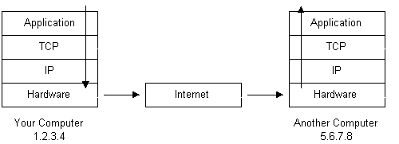

# 互联网如何工作？

> 互联网是一个使用互联网协议族（TCP/IP）来连接全球范围内数以十亿计的设备而组成的一个相互连接的计算机网络系统。这个网络由数百万的私人的，公共的，学术的，企业的，政府的网络构成，通过电子的，无线的和光纤网络技术实现连接。它承载了巨大的信息数据和服务，例如相互链接的超文本文档和万维网应用，电子邮件，电话服务和点对点文件传输。[以上解释引用自维基百科](https://en.wikipedia.org/wiki/Internet)

## 引言

互联网是如何工作的？这个问题问得好。互联网的增长已经呈现爆炸式增长的趋势，它随处可见。正因为它已经成为了生活的一部分，所以我们才需要更好的理解它工作的原理以便更好的使用。

本篇文章就来解释通过什么基础设备和技术使得互联网可以运行。对于一些技术问题不会太深入，但是足以覆盖每一个点给出一个涉及到相关概念的基础解释。

## 从地址开始

因为互联网是全球的计算机互相连接，所以每一台连接到互联网的电脑必须有一个唯一的地址。互联网地址的格式为`xxx.xxx.xxx.xxx`，其中`xxx`是一个 0 到 255 的数字。这个地址被称为 IP 地址。（IP 代表了互联网协议；稍后详述）

下面的图片举例说明了两台连接了互联网的电脑；一台电脑 IP 地址是 1.2.3.4，另外一台是 5.6.7.8。而互联网在图中被表示成一个抽象的物体在两台电脑中间。（随着本文后续的讲解，下面这个图1会被提起多次直到互联网的细节被说明）

  

图1

如果你是通过互联网服务提供商（ISP）连接的网络，通常你会被指定一个临时的 IP 地址为了你在接入网络的这一段时间使用。如果你通过局域网（LAN）连接至网络，那么你的电脑可能会有一个不变的 IP 地址或者通过动态主机配置协议获取一个临时 IP 地址。无论如何，如果你连接了互联网，你的电脑就会拥有一个唯一的 IP 地址。

#### **了解一下：`ping`命令**

如果你正在使用微软系统或者一种 Unix 系统，并且连接了网络，系统中有一个方便的程序用来查看当前的网络连接是正常的。这个命令叫做 **ping**，也许这个名字与旧式潜艇声纳系统的声音有关。如果你的系统是 windows，先打开一个命令提示符窗口。如果你使用的是类 Unix 系统，同样到命令提示符中。输入`ping www.baidu.com`。ping 命令会发送一个'ping'（实际上是一个 ICMP 回声请求信息，也就是因特网控制消息协议的请求信息）到指定名字的电脑。被 ping 的电脑会对你的信息作出响应。ping 程序会计算从消息发出到接收到响应一共花费了多少时间（如果接受到了目标电脑的响应）。同样，如果你输入的是一个域名而不是一个 IP 地址，ping 命令会将域名解析为 IP 地址。稍后再来讲解域名和地址解决方案。

  

## 协议栈和数据包

你的电脑现在已经连接到了网络并且拥有了唯一的地址。但是它如何才能和其他同样联网的电脑交流呢？下面有这样一个例子：假设你的 IP 地址是 1.2.3.4，现在你想向电脑 5.6.7.8 的一台电脑发送一个信息。这条信息的内容是“Hello computer 5.6.7.8!”。很明显，这条信息必然会经过网线从你的电脑传送至网络。假设你现在已经接入了当地的互联网服务提供商（例如，联通，电信），那么信息文本一定会先被翻译成电子信号，经过网络的传送后，电子信号再被重新转变回原来的文本信息。这个过程是如何实现的？这是凭借了**协议栈**的使用。每一台电脑都需要和网络上其他电脑交流的能力，这种能力也就是协议栈通常被内建在操作系统中。网络中使用的协议栈就是指 TCP/IP 协议，它们主要作为电脑之间交流使用的协议。TCP/IP 协议看起来就像下面这样子：

<table>
  <tr>
    <th>协议层次</th>
    <th>说明</th>
  </tr>
  <tr>
    <td>应用层协议</td>
    <td>与具体的应用有关的协议，例如 WWW，e-mail，FTP 等等</td>
  </tr>
  <tr>
    <td>传输控制层协议</td>
    <td>TCP 将数据包通过一个端口号传送给具体的应用</td>
  </tr>
  <tr>
    <td>网络层协议</td>
    <td>IP 将数据包通过 IP 地址传递给具体的电脑</td>
  </tr>
  <tr>
    <td>硬件层协议</td>
    <td>将二进制数据包转换成网络信号传递后再转变回原样（比如网卡和电话线上网用的猫）</td>
  </tr>
</table>

如果我们一路跟着从我们的电脑发出的信息“Hello computer 5.6.7.8!”一直到接收方 IP 地址 5.6.7.8，那么就会发生如下流程：

  

图2

1. 一开始信息最先出现在协议栈的顶端然后一路向下走。
2. 如果需要传递的信息太长，那么每一个栈层会将传递的信息分割成小的数据块。这是因为通过网络传输的数据包需要是容易处理的。在网络中，这些数据块就是人们熟知的数据包。
3. 数据包会经过应用层然后继续经过 TCP 层。每一个数据包都会被指派一个端口号。当传输数据的时候我们需要知道哪一个目标电脑上的程序需要接收这个数据因为它会监听指定的端口号。
4. 在经过了 TCP 层后，数据包被传递给 IP 层。这个地方数据包可以确定目标地址的位置为 5.6.7.8。
5. 现在我们的数据包拥有了一个端口号和一个 IP 地址，它们已经准备好被传递了。硬件层只关心如何将数据包中的文本信息转换成电子信号然后将它们通过网线传递出去。
6. 在网线的另一头你的 ISP 和网络直接连接。ISP 路由检查每一个数据包的目标地址然后确定将数据发向哪里。通常，数据包的下一站是另外一个路由器。
7. 终于，数据包抵达了电脑 5.6.7.8。这里，数据包最开始出现在目标电脑的 TCP/IP 协议栈的最底部，它会向上走。
8. 当数据向上经过协议栈的时候，数据中由发送信息的电脑添加的，有关传输路线的数据（例如 IP 地址和端口号）都被剥除掉。
9. 当数据到达了协议栈的最顶端，数据包会被重新组装成原始格式"Hello computer 5.6.7.8!"

## 网络基础设施

那么现在你了解到了一个数据包是如何通过互联网从一台电脑到达林外一台电脑的了。但是这中间过程到底经历了什么？互联网到底由什么构成？让我们看看另外一个示意图：

  

图3

这里我们看到了最初的图1有了更多的细节。通过电话网络连接到互联网服务提供商这种物理连接可能很容易猜得到，但是越过它之后可能需要一些解释。

ISP （互联网服务提供商，例如联通电信）维持了一个“猫”（调制解调器）的池子，就是一大组“猫”在一起管理，这些“猫”都对应了接入网络的用户。这个池被一个专用的电脑来管理，它控制着数据流从“猫”池中传送到骨干网络或者专用线路路由器中。这个机构可能适用于作为一个端口服务器，它为连接网络而服务。有用的信息通常也存放在这里。

在数据包穿过了电话线网络和 ISP 的本地设备后，它们被传送到 ISP 的骨干网络或者说一个提供带宽的地方。在这里数据包会经历多个路由器和多个骨干网络，专用的线路或者其他网络直到它们找到了目的地，也就是地址为 5.6.7.8 的那台电脑。但是为什么我们不能直到精确的数据传输路线直达目标呢？其实是有方法的…

#### **了解一下：tracert 路由追踪命令**

如果你使用 windows 系统或者类 Unix 系统并且连接了网络，还有另外一种方便的命令。就是被称作路由追踪的命令 tracert，它显示了数据包传送到达目的地的传送路径。就如同 ping 一样，你需要在系统命令提示符中使用这个命令。打开命令提示符，输入`tracert www.baidu.com`。除了输入网址也可以直接输入 IP 地址。tracert 会打印出所有路由器，电脑和其他网络实体的列表，数据包就是通过这个列表里的设备一路传递到目标电脑的。

  

如果你使用路由追踪命令，你会察觉到一个数据包会穿过很多很多的电脑和路由器最终才能到达目的地。有很多电脑的名字和很长，例如 sjc2-core1-h2-0-0.atlas.digex.net 或者 fddi0-0.br4.SJC.globalcenter.net。这些都是路由器，它们可以决定你的数据包会发往哪里。上面的图例中显示了多个路由器，但是和实际情况相比并不算多。上面的图例只是表示了一个简单的网络结构。真实的互联网结构是非常复杂的。

## 因特网基础设施

因特网骨干是由很多大型网络互相连接构成的。这些大型网络被称为因特网服务提供商或者 NSP。有一些大型 NSP 是 UUNet，CerfNet，IBM，BBN Planet，SprintNet，PSINet 以及其他品牌和公司。这些对等网络之间连接以交换数据。每一个 NSP 都需要连接到三个网络接入点或者叫 NAP。在 NAP 上，数据包交换可能从一个 NSP 骨干跳到另一个 NSP 骨干。NSP 也和城域交换或者叫 MAE 之间互相连接。MAE 和 NAP 提供服务的目的是一样的但是它是私有的服务。NAP 是原始英特网的连接点。NAP 和 MAE 都适用于英特网交换点或者叫 IX。NSP 也会售卖带宽给小型网络，像 ISP 或者其他更小的带宽提供商。下面这张图展示了分层的互联网设施：

  

图4

这个图其实并不能表示一个真实的互联网。这个图只是打算演示 NSP 和其他小型 ISP 直接如何连接起来的。并没有哪个物理网络组件会像上图一样显示当它们的结构如图3那样。原因是单个的 NSP 骨干网络设备是一个很复杂的体系。很过 NSP 都会在它们的主站上发布它们的网络设备的地图。想要画出一张真实英特网的地图那几乎是不可能的一件事，因为它的体积实在太大，结构太复杂，而且结构一直在不断变化。

## 因特网路由层次

