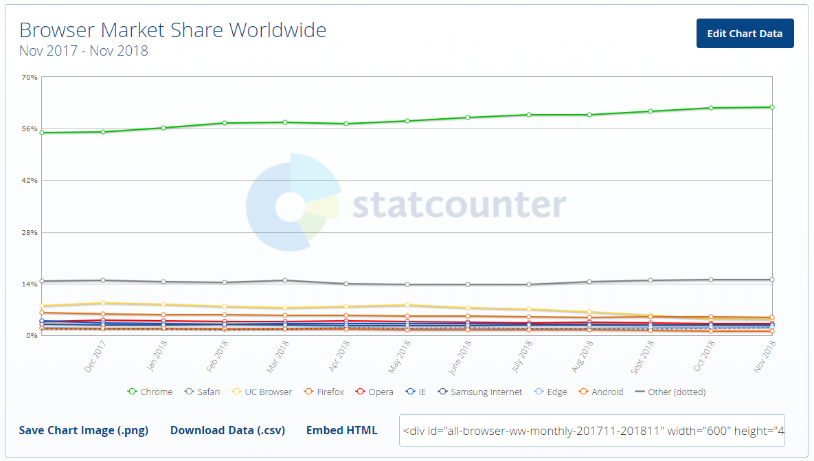

# 浏览器

> 一个网页浏览器是在万维网上获取查看信息的软件。每一个网页，图片，视频都被一个确切的 URL 所确定，使得浏览器可以在用户的设备上检索并且显示这些资源。浏览器和搜索引擎不是同一种东西，即使这两者经常被搞混。对于一个用户来说，一个搜索引擎只是一个网站，比如 google.com，它储存着关于其他网站的可搜索的数据。但是想要在设备上连接并且显示网站的内容，一个用户需要安装一个网页浏览器。目前世界上最流行的浏览器是 Chrome，Firefox，Safari，Internet Explorer，还有 Edge。[以上解释引用自维基百科](https://en.wikipedia.org/wiki/Web_browser)

## 使用最普遍的浏览器

1. [Chrome](http://www.google.com/chrome/) (引擎: [Blink](https://en.wikipedia.org/wiki/Blink_%28layout_engine%29) + [V8](https://en.wikipedia.org/wiki/V8_%28JavaScript_engine%29))
2. [Firefox](https://www.mozilla.org/en-US/firefox/new/) (引擎: [Gecko](https://en.wikipedia.org/wiki/Gecko_%28software%29) + [SpiderMonkey](https://en.wikipedia.org/wiki/SpiderMonkey_%28software%29))
3. [Internet Explorer](http://windows.microsoft.com/en-us/internet-explorer/download-ie) (引擎: [Trident](https://en.wikipedia.org/wiki/Trident_%28layout_engine%29) + [Chakra](https://en.wikipedia.org/wiki/Chakra_%28JScript_engine%29))
4. [Safari](https://www.apple.com/safari/) (引擎: [Webkit](https://en.wikipedia.org/wiki/WebKit) + [SquirrelFish](https://trac.webkit.org/wiki/SquirrelFish))

*注：浏览器引擎是每一个浏览器的核心组件。它的首要任务是将 HTML 文档和其他网页资源转换成可交互的视觉表现，然后呈现在用户的设备上。*

<p align="center">
  
</p>
<p align="center"><span>2017年11月至2018年11月全球浏览器市场份额</span></p>

## 使用最普遍的[无头浏览器](http://www.asad.pw/HeadlessBrowsers/):

* [Headless Chromium](https://chromium.googlesource.com/chromium/src/+/lkgr/headless/README.md) (engine: [Blink](https://www.chromium.org/blink) + V8)
* [PhantomJS](http://phantomjs.org/) (engine: [Webkit](https://en.wikipedia.org/wiki/WebKit) + SquirrelFish)
* [SlimerJS](http://slimerjs.org/) (engine: [Gecko](https://en.wikipedia.org/wiki/Gecko_%28software%29) + [SpiderMonkey](https://en.wikipedia.org/wiki/SpiderMonkey_%28software%29))
* [TrifleJS](https://github.com/sdesalas/trifleJS) (engine: [Trident](https://en.wikipedia.org/wiki/Trident_%28layout_engine%29) + [Chakra](https://en.wikipedia.org/wiki/Chakra_%28JScript_engine%29))

## 浏览器工作原理揭秘

*注：浏览器工作原理的内容整理自这篇文章：[How Browsers Work: Behind the scenes of modern web browsers](https://www.html5rocks.com/en/tutorials/internals/howbrowserswork/)*


### 序言

这是一篇全面介绍 WebKit 和 Gecko 内部操作的入门文章，是以色列开发人员塔利·加希尔大量研究的成果。在过去的几年中，她查阅了所有公开发布的关于浏览器内部机制的数据，并花了很多时间来研读网络浏览器的源代码。她写道：

> 在 IE 占据 90% 市场份额的年代，我们除了把浏览器当成一个“黑箱”，什么也做不了。但是现在，开放源代码的浏览器拥有了过半的市场份额，因此，是时候来揭开神秘的面纱，一探网络浏览器的内幕了。呃，里面只有数以百万行计的 C++ 代码… 塔利·加希尔(Tali Garsiel)

> 塔利在她的网站上公布了自己的研究成果，但是我们觉得它值得让更多的人来了解，所以我们在此重新整理并公布。作为一名网络开发人员，学习浏览器的内部工作原理将有助于您作出更明智的决策，并理解那些最佳开发实践的个中缘由。尽管这是一篇相当长的文档，但是我们建议您花些时间来仔细阅读；读完之后，您肯定会觉得所费不虚。保罗·爱丽诗 (Paul Irish)，Chrome 浏览器开发人员事务部

### 简介

网络浏览器很可能是使用最广的软件。在这篇入门文章中，我将会介绍它们的幕后工作原理。我们会了解到，从您在地址栏输入 google.com 直到您在浏览器屏幕上看到 Google 首页的整个过程中都发生了些什么。

### 我们要讨论的浏览器

目前使用的主流浏览器有五个：Internet Explorer、Firefox、Safari、Chrome 浏览器和 Opera。本文中以开放源代码浏览器为例，即 Firefox、Chrome 浏览器和 Safari（部分开源）。根据 StatCounter 浏览器统计数据，目前（2018 年 12 月）Firefox、Safari 和 Chrome 浏览器的总市场占有率已经超过 80%。由此可见，如今开放源代码浏览器在浏览器市场中占据了非常坚实的部分。

### 浏览器的主要功能

浏览器的主要功能就是向服务器发出请求，在浏览器窗口中展示您选择的网络资源。这里所说的资源一般是指 HTML 文档，也可以是 PDF、图片或其他的类型。资源的位置由用户使用 URI（统一资源标示符）指定。

浏览器解释并显示 HTML 文件的方式是在 HTML 和 CSS 规范中指定的。这些规范由网络标准化组织 W3C（万维网联盟）进行维护。 
多年以来，各浏览器都没有完全遵从这些规范，同时还在开发自己独有的扩展程序，这给网络开发人员带来了严重的兼容性问题。如今，大多数的浏览器都是或多或少地遵从规范。

浏览器的用户界面有很多彼此相同的元素，其中包括：

* 用来输入 URI 的地址栏
* 前进和后退按钮
* 书签设置选项
* 用于刷新和停止加载当前文档的刷新和停止按钮
* 用于返回主页的主页按钮

奇怪的是，浏览器的用户界面并没有任何正式的规范，这是多年来的最佳实践自然发展以及彼此之间相互模仿的结果。HTML5 也没有定义浏览器必须具有的用户界面元素，但列出了一些通用的元素，例如地址栏、状态栏和工具栏等。当然，各浏览器也可以有自己独特的功能，比如 Firefox 的下载管理器。

### 浏览器的高层结构

浏览器的主要组件为：

1. **用户界面** - 包括地址栏、前进/后退按钮、书签菜单等。除了浏览器主窗口显示的您请求的页面外，其他显示的各个部分都属于用户界面。
1. **浏览器引擎** - 在用户界面和呈现引擎之间传送指令。
1. **呈现引擎** - 负责显示请求的内容。如果请求的内容是 HTML，它就负责解析 HTML 和 CSS 内容，并将解析后的内容显示在屏幕上。
1. **网络** - 用于网络调用，比如 HTTP 请求。其接口与平台无关，并为所有平台提供底层实现。
1. **用户界面后端** - 用于绘制基本的窗口小部件，比如组合框和窗口。其公开了与平台无关的通用接口，而在底层使用操作系统的用户界面方法。
1. **JavaScript 解释器**。用于解析和执行 JavaScript 代码。
1. **数据存储**。这是持久层。浏览器需要在硬盘上保存各种数据，例如 Cookie。新的 HTML 规范 (HTML5) 定义了“网络数据库”，这是一个完整（但是轻便）的浏览器内数据库。

<p align="center">
  
</p>
<p align="center"><span>浏览器主要组件</span></p>

值得注意的是，和大多数浏览器不同，Chrome 浏览器的每个标签页都分别对应一个呈现引擎实例。每个标签页都是一个独立的进程。

### 呈现引擎

呈现引擎的作用嘛...当然就是“呈现”了，也就是在浏览器的屏幕上显示请求的内容。

默认情况下，呈现引擎可显示 HTML 和 XML 文档与图片。通过插件（或浏览器扩展程序），还可以显示其他类型的内容；例如，使用 PDF 查看器插件就能显示 PDF 文档。但是在本章中，我们将集中介绍其**主要用途**：**显示使用 CSS 格式化的 HTML 内容和图片**。

本文所讨论的浏览器（Firefox、Chrome 和 Safari）是基于两种呈现引擎构建的。Firefox 使用的是 `Gecko`，这是 Mozilla 公司“自制”的呈现引擎。而 Safari 和 Chrome 浏览器使用的都是 `WebKit`。

`WebKit` 是一种开放源代码呈现引擎，起初用于 Linux 平台，随后由 Apple 公司进行修改，从而支持苹果机和 Windows。有关详情，请参阅 [webkit.org](http://webkit.org/)。

#### 主流程

呈现引擎一开始会从网络层获取请求文档的内容，内容的大小一般限制在 8000 个块以内。

然后进行如下所示的基本流程：

<p align="center">
  
</p>
<p align="center"><span>呈现引擎的基本流程</span></p>

呈现引擎将开始解析 HTML 文档，并将各标记逐个转化成“内容树”上的 DOM 节点。同时也会解析外部 CSS 文件以及样式元素中的样式数据。HTML 中这些带有视觉指令的样式信息将用于创建另一个树结构：呈现树。

呈现树包含多个带有视觉属性（如颜色和尺寸）的矩形。这些矩形的排列顺序就是它们将在屏幕上显示的顺序。

呈现树构建完毕之后，进入“布局”处理阶段，也就是为每个节点分配一个应出现在屏幕上的确切坐标。下一个阶段是绘制 - 呈现引擎会遍历呈现树，由用户界面后端层将每个节点绘制出来。

需要着重指出的是，这是一个渐进的过程。为达到更好的用户体验，呈现引擎会力求尽快将内容显示在屏幕上。它不必等到整个 HTML 文档解析完毕之后，就会开始构建呈现树和设置布局。在不断接收和处理来自网络的其余内容的同时，呈现引擎会将部分内容解析并显示出来。

#### 主流程示例

<p align="center">
  
</p>
<p align="center"><span>WebKit 主流程</span></p>

<p align="center">
  
</p>
<p align="center"><span>Mozilla 的 Gecko 呈现引擎主流程</span></p>

从图中可以看出，虽然 WebKit 和 Gecko 使用的术语略有不同，但整体流程是基本相同的。

Gecko 将视觉格式化元素组成的树称为“框架树”。每个元素都是一个框架。WebKit 使用的术语是“呈现树”，它由“呈现对象”组成。对于元素的放置，WebKit 使用的术语是“布局”，而 Gecko 称之为“重排”。对于连接 DOM 节点和可视化信息从而创建呈现树的过程，WebKit 使用的术语是“附加”。有一个细微的非语义差别，就是 Gecko 在 HTML 与 DOM 树之间还有一个称为“内容槽”的层，用于生成 DOM 元素。我们会逐一论述流程中的每一部分：

### 解析和 DOM 树构建

#### 解析 - 综述

解析是呈现引擎中非常重要的一个环节，因此我们要更深入地讲解。首先，来介绍一下解析。

解析文档是指将文档转化成为有意义的结构，也就是可让代码理解和使用的结构。解析得到的结果通常是代表了文档结构的节点树，它称作解析树或者语法树。

示例 - 解析 2 + 3 - 1 这个表达式，会返回下面的树：

<p align="center">
  
</p>
<p align="center"><span>数学表达式树节点</span></p>

##### 语法

解析是以文档所遵循的语法规则（编写文档所用的语言或格式）为基础的。所有可以解析的格式都必须对应确定的语法（由词汇和语法规则构成）。这称为与**上下文无关的语法**。人类语言并不属于这样的语言，因此无法用常规的解析技术进行解析。

##### 解析器和词法分析器的组合

解析的过程可以分成两个子过程：词法分析和语法分析。

词法分析是将输入内容分割成大量标记的过程。标记是语言中的词汇，即构成内容的单位。在人类语言中，它相当于语言字典中的单词。

语法分析是应用语言的语法规则的过程。

解析器通常将解析工作分给以下两个组件来处理：**词法分析器**（有时也称为标记生成器），负责将输入内容分解成一个个有效标记；而**解析器**负责根据语言的语法规则分析文档的结构，从而构建解析树。词法分析器知道如何将无关的字符（比如空格和换行符）分离出来。

<p align="center">
  
</p>
<p align="center"><span>从源文档到解析树</span></p>

解析是一个迭代的过程。通常，解析器会向词法分析器请求一个新标记，并尝试将其与某条语法规则进行匹配。如果发现了匹配规则，解析器会将一个对应于该标记的节点添加到解析树中，然后继续请求下一个标记。

如果没有规则可以匹配，解析器就会将标记存储到内部，并继续请求标记，直至找到可与所有内部存储的标记匹配的规则。如果找不到任何匹配规则，解析器就会引发一个异常。这意味着文档无效，包含语法错误。

##### 翻译

很多时候，解析树还不是最终产品。解析通常是在翻译过程中使用的，而**翻译**是指将输入文档转换成另一种格式。编译就是这样一个例子。编译器可将源代码编译成机器代码，具体过程是首先将源代码解析成解析树，然后将解析树翻译成机器代码文档。

<p align="center">
  
</p>
<p align="center"><span>编译流程</span></p>

##### 解析示例

在上面的数学表达式树节点 图中，我们通过一个数学表达式建立了解析树。现在，让我们试着定义一个简单的数学语言，用来演示解析的过程。

**词汇**：我们用的语言可包含整数、加号和减号。

**语法**：

* 构成语言的语法单位是表达式、项和运算符。
* 我们用的语言可以包含任意数量的表达式。
* 表达式的定义是：一个“项”接一个“运算符”，然后再接一个“项”。
* 运算符是加号或减号。
* 项是一个整数或一个表达式。

让我们分析一下 2 + 3 - 1。 

匹配语法规则的第一个子串是 2，而根据第 5 条语法规则，这是一个项。匹配语法规则的第二个子串是 2 + 3，而根据第 3 条规则（一个项接一个运算符，然后再接一个项），这是一个表达式。下一个匹配项已经到了输入的结束。2 + 3 - 1 是一个表达式，因为我们已经知道 2 + 3 是一个项，这样就符合“一个项接一个运算符，然后再接一个项”的规则。2 + + 不与任何规则匹配，因此是无效的输入。

##### 词汇和语法的正式定义

**词汇**通常用正则表达式表示。

例如，我们的示例语言可以定义如下：

```
INTEGER :0|[1-9][0-9]*
PLUS : +
MINUS: -
```
正如您所看到的，这里用正则表达式给出了整数的定义。
**语法**通常使用一种称为`BNF`的格式来定义。我们的示例语言可以定义如下：

```
expression :=  term  operation  term
operation :=  PLUS | MINUS
term := INTEGER | expression
```

之前我们说过，如果语言的语法是**与上下文无关的语法**，就可以由常规解析器进行解析。与上下文无关的语法的直观定义就是可以完全用 BNF 格式表达的语法。有关正式定义，请参阅[关于与上下文无关的语法的维基百科文章](http://en.wikipedia.org/wiki/Context-free_grammar)。

##### 解析器类型

有两种基本类型的解析器：*自上而下解析器*和*自下而上解析器*。直观地来说，自上而下的解析器从语法的高层结构出发，尝试从中找到匹配的结构。而自下而上的解析器从低层规则出发，将输入内容逐步转化为语法规则，直至满足高层规则。

让我们来看看这两种解析器会如何解析我们的示例：

自上而下的解析器会从高层的规则开始：首先将 2 + 3 标识为一个表达式，然后将 2 + 3 - 1 标识为一个表达式（标识表达式的过程涉及到匹配其他规则，但是起点是最高级别的规则）。

自下而上的解析器将扫描输入内容，找到匹配的规则后，将匹配的输入内容替换成规则。如此继续替换，直到输入内容的结尾。部分匹配的表达式保存在解析器的堆栈中。

<table>
  <tr>
    <th>堆栈</th>
    <th>输入</th>
  </tr>
  <tr>
    <td></td>
    <td>2 + 3 - 1</td>
  </tr>
  <tr>
    <td>项</td>
    <td>+ 3 - 1</td>
  </tr>
  <tr>
    <td>项运算</td>
    <td>3 - 1</td>
  </tr>
  <tr>
    <td>表达式</td>
    <td>- 1</td>
  </tr>
  <tr>
    <td>表达式运算符</td>
    <td>1</td>
  </tr>
  <tr>
    <td>表达式</td>
    <td></td>
  </tr>
</table>

这种自下而上的解析器称为移位归约解析器，因为输入在向右移位（设想有一个指针从输入内容的开头移动到结尾），并且逐渐归约到语法规则上。

##### 自动生成解析器

有一些工具可以帮助您生成解析器，它们称为解析器生成器。您只要向其提供您所用语言的语法（词汇和语法规则），它就会生成相应的解析器。创建解析器需要对解析有深刻理解，而人工创建并优化解析器并不是一件容易的事情，所以解析器生成器是非常实用的。

WebKit 使用了两种非常有名的解析器生成器：用于创建词法分析器的 Flex 以及用于创建解析器的 Bison（您也可能遇到 Lex 和 Yacc 这样的别名）。Flex 的输入是包含标记的正则表达式定义的文件。Bison 的输入是采用 BNF 格式的语言语法规则。

#### HTML 解析器

HTML 解析器的任务是将 HTML 标记解析成解析树。

##### HTML 语法定义

HTML 的词汇和语法在 W3C 组织创建的规范中进行了定义。

##### 非与上下文无关的语法

正如我们在解析过程的简介中已经了解到的，语法可以用 BNF 等格式进行正式定义。

很遗憾，所有的常规解析器都不适用于 HTML（我并不是开玩笑，它们可以用于解析 CSS 和 JavaScript）。HTML 并不能很容易地用解析器所需的与上下文无关的语法来定义。

有一种可以定义 HTML 的正规格式：DTD（Document Type Definition，文档类型定义），但它不是与上下文无关的语法。

这初看起来很奇怪：HTML 和 XML 非常相似。有很多 XML 解析器可以使用。HTML 存在一个 XML 变体 (XHTML)，那么有什么大的区别呢？

**区别在于 HTML 的处理更为“宽容”**，它允许您省略某些隐式添加的标记，有时还能省略一些起始或者结束标记等等。和 XML 严格的语法不同，HTML 整体来看是一种“软性”的语法。

显然，这种看上去细微的差别实际上却带来了巨大的影响。一方面，这是 HTML 如此流行的原因：它能包容您的错误，简化网络开发。另一方面，这使得它很难编写正式的语法。概括地说，HTML 无法很容易地通过常规解析器解析（因为它的语法不是与上下文无关的语法），也无法通过 XML 解析器来解析。

##### HTML DTD

HTML 的定义采用了 DTD 格式。此格式可用于定义 SGML 族的语言。它包括所有允许使用的元素及其属性和层次结构的定义。如上文所述，HTML DTD 无法构成与上下文无关的语法。

DTD 存在一些变体。严格模式完全遵守 HTML 规范，而其他模式可支持以前的浏览器所使用的标记。这样做的目的是确保向下兼容一些早期版本的内容。

##### DOM

解析器的输出“解析树”是由 DOM 元素和属性节点构成的树结构。DOM 是文档对象模型 (Document Object Model) 的缩写。它是 HTML 文档的对象表示，同时也是外部内容（例如 JavaScript）与 HTML 元素之间的接口。 
解析树的根节点是“Document”对象。

DOM 与标记之间几乎是一一对应的关系。比如下面这段标记：

```html
<html>
  <body>
    <p>
      Hello World
    </p>
    <div> </div>
  </body>
</html>
```

可翻译成如下的 DOM 树：

<p align="center">
  
</p>
<p align="center"><span>示例标记的 DOM 树</span></p>

和 HTML 一样，DOM 也是由 W3C 组织指定的。请参见 [www.w3.org/DOM/DOMTR](www.w3.org/DOM/DOMTR)。这是关于文档操作的通用规范。其中一个特定模块描述针对 HTML 的元素。HTML 的定义可以在这里找到：[www.w3.org/TR/2003/REC-DOM-Level-2-HTML-20030109/idl-definitions.html](www.w3.org/TR/2003/REC-DOM-Level-2-HTML-20030109/idl-definitions.html)。

我所说的树包含 DOM 节点，指的是树是由实现了某个 DOM 接口的元素构成的。浏览器在具体的实现中会有一些供内部使用的其他属性。

##### 解析算法

我们在之前章节已经说过，HTML 无法用常规的自上而下或自下而上的解析器进行解析。

原因在于：

1. 语言的宽容本质。
1. 浏览器历来对一些常见的无效 HTML 用法采取包容态度。
1. 解析过程需要不断地反复。源内容在解析过程中通常不会改变，但是在 HTML 中，脚本标记如果包含 `document.write`，就会添加额外的标记，这样解析过程实际上就更改了输入内容。

由于不能使用常规的解析技术，浏览器就创建了自定义的解析器来解析 HTML。

[HTML5 规范详细地描述了解析算法](http://www.whatwg.org/specs/web-apps/current-work/multipage/parsing.html)。此算法由两个阶段组成：标记化和树构建。

标记化是词法分析过程，将输入内容解析成多个标记。HTML 标记包括起始标记、结束标记、属性名称和属性值。

标记生成器识别标记，传递给树构造器，然后接受下一个字符以识别下一个标记；如此反复直到输入的结束。

<p align="center">
  
</p>
<p align="center"><span>HTML 解析流程（摘自 HTML5 规范）</span></p>

##### 标记化算法

该算法的输出结果是 HTML 标记。该算法使用状态机来表示。每一个状态接收来自输入信息流的一个或多个字符，并根据这些字符更新下一个状态。当前的标记化状态和树结构状态会影响进入下一状态的决定。这意味着，即使接收的字符相同，对于下一个正确的状态也会产生不同的结果，具体取决于当前的状态。该算法相当复杂，无法在此详述，所以我们通过一个简单的示例来帮助大家理解其原理。

基本示例 - 将下面的 HTML 代码标记化：

```html
<html>
  <body>
    Hello world
  </body>
</html>
```

初始状态是数据状态。遇到字符 < 时，状态更改为“标记打开状态”。接收一个 a-z 字符会创建“起始标记”，状态更改为“标记名称状态”。这个状态会一直保持到接收 > 字符。在此期间接收的每个字符都会附加到新的标记名称上。在本例中，我们创建的标记是 html 标记。

遇到 > 标记时，会发送当前的标记，状态改回“数据状态”。<body> 标记也会进行同样的处理。目前 html 和 body 标记均已发出。现在我们回到“数据状态”。接收到 Hello world 中的 H 字符时，将创建并发送字符标记，直到接收 </body> 中的 <。我们将为 Hello world 中的每个字符都发送一个字符标记。

现在我们回到“标记打开状态”。接收下一个输入字符 / 时，会创建 end tag token 并改为“标记名称状态”。我们会再次保持这个状态，直到接收 >。然后将发送新的标记，并回到“数据状态”。</html> 输入也会进行同样的处理。

<p align="center">
  
</p>
<p align="center"><span>对示例输入进行标记化</span></p>

##### 树构建算法

