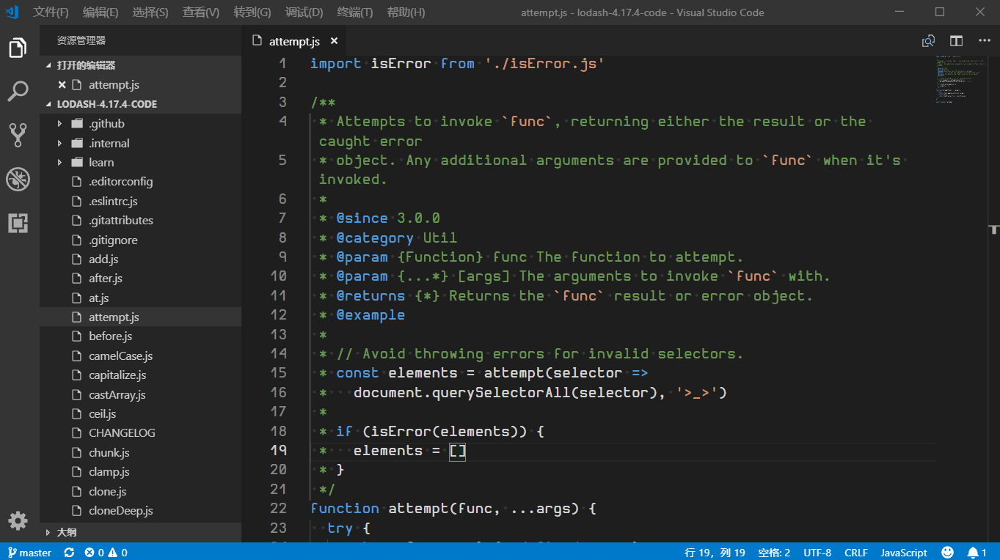

# 开发工具及环境

## 前言

>工欲善其事，必先利其器

学习之前的准备工作很重要，这里面就包括了开发环境与开发工具的安装。

适合前端使用的开发工具有很多，比如 Sublime Text、Visual Studio Code、WebStorm 等等。

我在这里推荐使用`Visual Studio Code`，简称`vscode`，它是微软团队开发的开源代码编辑器，免费并且集成了很多有用的插件，值得一提的是，它本身也是使用前端技术开发而成的。

  

## 下载安装

打开[Visual Studio Code](https://code.visualstudio.com/)官网下载最新的稳定版安装包安装即可。

vscode支持 win、mac、linux 三种平台。

## 基础设置

### 设置中文

刚安装好后是下面这个样子：

  

接着我们可以点击左侧的扩展图标打开扩展面板，然后搜索中文补丁插件，安装重启后软件就会变成中文界面。

  

安装中文插件的地方就是在扩展面板中，扩展面板中有着大量的vscode插件可供开发者选择，里面有非常多的优质插件，如果需要框架语法高亮或者自动重命名标签又或者显示语法提示信息都可以去下载插件支持，也可以开发自己的插件。

### 在设置中对编辑器进行设置

点击左下角的齿轮图标选择菜单中的设置即可打开设置界面，有搜索框可以搜索想要设置的配置项。

如下图，显示了如何在设置中设置开启自动代码换行和修改制表符的长度等于２个空格。

  

设置中有很多配置项，通常需要自定义的配置项有

- Editor: Tab Size 制表符长度
- Editor: Font Size 字体大小
- Editor: Font Family 字体
- Editor: Word Wrap 控制换行方式

### 切换编辑器的主题和文件图标主题

如下图所示切换主题和文件图标主题。

  

编辑器主题和文件图标主题都可以在扩展面板中搜索下载，或者到官网的[扩展页面](https://marketplace.visualstudio.com/search?target=VSCode&category=Themes&sortBy=Downloads)搜索好看的主题。

## 其他常用功能

- 切换代码中的空格呈现

  

- 切换缩进空格显示单位

  

- 搜索任意命令，按下快捷键`ctrl + shift + p`后在弹出的搜索面板中输入想要搜索的命令名称即可

  

- 以文件名为条件搜索，按下快捷键`ctrl + p`后在弹出的搜索面板中输入想要搜索的文件名即可

  

- 搜索整个项目文件夹中的任意字符，按下快捷键`ctrl + shift + f`后在资源管理器面板中显示的搜索面板输入想要搜索的字符即可

  

- 在文件夹中查找任意字符，在资源管理器面板中的某个文件夹上右键点击，在出现的右键菜单中选择`在文件夹中查找`选项，然后输入想要搜索的字符即可

  

