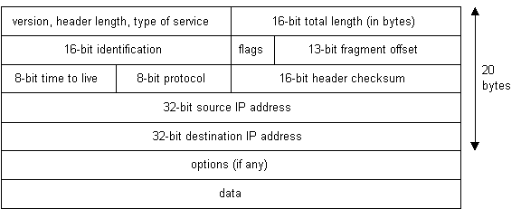

# 互联网如何工作？

> 互联网是一个使用互联网协议族（TCP/IP）来连接全球范围内数以十亿计的设备而组成的一个相互连接的计算机网络系统。这个网络由数百万的私人的，公共的，学术的，企业的，政府的网络构成，通过电子的，无线的和光纤网络技术实现连接。它承载了巨大的信息数据和服务，例如相互链接的超文本文档和万维网应用，电子邮件，电话服务和点对点文件传输。[以上解释引用自维基百科](https://en.wikipedia.org/wiki/Internet)

## 引言

互联网是如何工作的？这个问题问得好。互联网的增长已经呈现爆炸式增长的趋势，它随处可见。正因为它已经成为了生活的一部分，所以我们才需要更好的理解它工作的原理以便更好的使用。

本篇文章就来解释通过什么基础设备和技术使得互联网可以运行。对于一些技术问题不会太深入，但是足以覆盖每一个点给出一个涉及到相关概念的基础解释。

## 从地址开始

因为互联网是全球的计算机互相连接，所以每一台连接到互联网的电脑必须有一个唯一的地址。互联网地址的格式为`xxx.xxx.xxx.xxx`，其中`xxx`是一个 0 到 255 的数字。这个地址被称为 IP 地址。（IP 代表了互联网协议；稍后详述）

下面的图片举例说明了两台连接了互联网的电脑；一台电脑 IP 地址是 1.2.3.4，另外一台是 5.6.7.8。而互联网在图中被表示成一个抽象的物体在两台电脑中间。（随着本文后续的讲解，下面这个图1会被提起多次直到互联网的细节被说明）

<p align="center">
  
</p>
<p align="center"><span>图1</span></p>

如果你是通过互联网服务提供商（ISP）连接的网络，通常你会被指定一个临时的 IP 地址为了你在接入网络的这一段时间使用。如果你通过局域网（LAN）连接至网络，那么你的电脑可能会有一个不变的 IP 地址或者通过动态主机配置协议获取一个临时 IP 地址。无论如何，如果你连接了互联网，你的电脑就会拥有一个唯一的 IP 地址。

#### **了解一下：`ping`命令**

如果你正在使用微软系统或者一种 Unix 系统，并且连接了网络，系统中有一个方便的程序用来查看当前的网络连接是正常的。这个命令叫做 **ping**，也许这个名字与旧式潜艇声纳系统的声音有关。如果你的系统是 windows，先打开一个命令提示符窗口。如果你使用的是类 Unix 系统，同样到命令提示符中。输入`ping www.baidu.com`。ping 命令会发送一个'ping'（实际上是一个 ICMP 回声请求信息，也就是因特网控制消息协议的请求信息）到指定名字的电脑。被 ping 的电脑会对你的信息作出响应。ping 程序会计算从消息发出到接收到响应一共花费了多少时间（如果接受到了目标电脑的响应）。同样，如果你输入的是一个域名而不是一个 IP 地址，ping 命令会将域名解析为 IP 地址。稍后再来讲解域名和地址解决方案。

<p align="center">
  
</p>

## 协议栈和数据包

你的电脑现在已经连接到了网络并且拥有了唯一的地址。但是它如何才能和其他同样联网的电脑交流呢？下面有这样一个例子：假设你的 IP 地址是 1.2.3.4，现在你想向电脑 5.6.7.8 的一台电脑发送一个信息。这条信息的内容是“Hello computer 5.6.7.8!”。很明显，这条信息必然会经过网线从你的电脑传送至网络。假设你现在已经接入了当地的互联网服务提供商（例如，联通，电信），那么信息文本一定会先被翻译成电子信号，经过网络的传送后，电子信号再被重新转变回原来的文本信息。这个过程是如何实现的？这是凭借了**协议栈**的使用。每一台电脑都需要和网络上其他电脑交流的能力，这种能力也就是协议栈通常被内建在操作系统中。网络中使用的协议栈就是指 TCP/IP 协议，它们主要作为电脑之间交流使用的协议。TCP/IP 协议看起来就像下面这样子：

<table>
  <tr>
    <th>协议层次</th>
    <th>说明</th>
  </tr>
  <tr>
    <td>应用层协议</td>
    <td>与具体的应用有关的协议，例如 WWW，e-mail，FTP 等等</td>
  </tr>
  <tr>
    <td>传输控制层协议</td>
    <td>TCP 将数据包通过一个端口号传送给具体的应用</td>
  </tr>
  <tr>
    <td>网络层协议</td>
    <td>IP 将数据包通过 IP 地址传递给具体的电脑</td>
  </tr>
  <tr>
    <td>硬件层协议</td>
    <td>将二进制数据包转换成网络信号传递后再转变回原样（比如网卡和电话线上网用的猫）</td>
  </tr>
</table>

如果我们一路跟着从我们的电脑发出的信息“Hello computer 5.6.7.8!”一直到接收方 IP 地址 5.6.7.8，那么就会发生如下流程：

<p align="center">
  
</p>
<p align="center"><span>图2</span></p>

1. 一开始信息最先出现在协议栈的顶端然后一路向下走。
2. 如果需要传递的信息太长，那么每一个栈层会将传递的信息分割成小的数据块。这是因为通过网络传输的数据包需要是容易处理的。在网络中，这些数据块就是人们熟知的数据包。
3. 数据包会经过应用层然后继续经过 TCP 层。每一个数据包都会被指派一个端口号。当传输数据的时候我们需要知道哪一个目标电脑上的程序需要接收这个数据因为它会监听指定的端口号。
4. 在经过了 TCP 层后，数据包被传递给 IP 层。这个地方数据包可以确定目标地址的位置为 5.6.7.8。
5. 现在我们的数据包拥有了一个端口号和一个 IP 地址，它们已经准备好被传递了。硬件层只关心如何将数据包中的文本信息转换成电子信号然后将它们通过网线传递出去。
6. 在网线的另一头你的 ISP 和网络直接连接。ISP 路由检查每一个数据包的目标地址然后确定将数据发向哪里。通常，数据包的下一站是另外一个路由器。
7. 终于，数据包抵达了电脑 5.6.7.8。这里，数据包最开始出现在目标电脑的 TCP/IP 协议栈的最底部，它会向上走。
8. 当数据向上经过协议栈的时候，数据中由发送信息的电脑添加的，有关传输路线的数据（例如 IP 地址和端口号）都被剥除掉。
9. 当数据到达了协议栈的最顶端，数据包会被重新组装成原始格式"Hello computer 5.6.7.8!"

## 网络基础设施

那么现在你了解到了一个数据包是如何通过互联网从一台电脑到达林外一台电脑的了。但是这中间过程到底经历了什么？互联网到底由什么构成？让我们看看另外一个示意图：

<p align="center">
  
</p>
<p align="center"><span>图3</span></p>

这里我们看到了最初的图1有了更多的细节。通过电话网络连接到互联网服务提供商这种物理连接可能很容易猜得到，但是越过它之后可能需要一些解释。

ISP （互联网服务提供商，例如联通电信）维持了一个“猫”（调制解调器）的池子，就是一大组“猫”在一起管理，这些“猫”都对应了接入网络的用户。这个池被一个专用的电脑来管理，它控制着数据流从“猫”池中传送到骨干网络或者专用线路路由器中。这个机构可能适用于作为一个端口服务器，它为连接网络而服务。有用的信息通常也存放在这里。

在数据包穿过了电话线网络和 ISP 的本地设备后，它们被传送到 ISP 的骨干网络或者说一个提供带宽的地方。在这里数据包会经历多个路由器和多个骨干网络，专用的线路或者其他网络直到它们找到了目的地，也就是地址为 5.6.7.8 的那台电脑。但是为什么我们不能直到精确的数据传输路线直达目标呢？其实是有方法的…

#### **了解一下：tracert 路由追踪命令**

如果你使用 windows 系统或者类 Unix 系统并且连接了网络，还有另外一种方便的命令。就是被称作路由追踪的命令 tracert，它显示了数据包传送到达目的地的传送路径。就如同 ping 一样，你需要在系统命令提示符中使用这个命令。打开命令提示符，输入`tracert www.baidu.com`。除了输入网址也可以直接输入 IP 地址。tracert 会打印出所有路由器，电脑和其他网络实体的列表，数据包就是通过这个列表里的设备一路传递到目标电脑的。

<p align="center">
  
</p>

如果你使用路由追踪命令，你会察觉到一个数据包会穿过很多很多的电脑和路由器最终才能到达目的地。有很多电脑的名字和很长，例如 sjc2-core1-h2-0-0.atlas.digex.net 或者 fddi0-0.br4.SJC.globalcenter.net。这些都是路由器，它们可以决定你的数据包会发往哪里。上面的图例中显示了多个路由器，但是和实际情况相比并不算多。上面的图例只是表示了一个简单的网络结构。真实的互联网结构是非常复杂的。

## 因特网基础设施

因特网骨干是由很多大型网络互相连接构成的。这些大型网络被称为因特网服务提供商或者 NSP。有一些大型 NSP 是 UUNet，CerfNet，IBM，BBN Planet，SprintNet，PSINet 以及其他品牌和公司。这些对等网络之间连接以交换数据。每一个 NSP 都需要连接到三个网络接入点或者叫 NAP。在 NAP 上，数据包交换可能从一个 NSP 骨干跳到另一个 NSP 骨干。NSP 也和城域交换或者叫 MAE 之间互相连接。MAE 和 NAP 提供服务的目的是一样的但是它是私有的服务。NAP 是原始英特网的连接点。NAP 和 MAE 都适用于英特网交换点或者叫 IX。NSP 也会售卖带宽给小型网络，像 ISP 或者其他更小的带宽提供商。下面这张图展示了分层的互联网设施：

<p align="center">
  
</p>
<p align="center"><span>图4</span></p>

这个图其实并不能表示一个真实的互联网。这个图只是打算演示 NSP 和其他小型 ISP 直接如何连接起来的。并没有哪个物理网络组件会像上图一样显示当它们的结构如图3那样。原因是单个的 NSP 骨干网络设备是一个很复杂的体系。很过 NSP 都会在它们的主站上发布它们的网络设备的地图。想要画出一张真实英特网的地图那几乎是不可能的一件事，因为它的体积实在太大，结构太复杂，而且结构一直在不断变化。

## 因特网路由层次

数据包如果才能找到传输的正确路径？是否因特网中的每一台电脑都知道其他电脑的位置？是否一个数据包会传播至所有其他联网的电脑？这些问题的答案都是否。没有哪个电脑知道其他电脑的确切位置，数据包也不会被发送到所有联网的电脑。数据包被发送到目的地所需要的信息都被网络中的路由器的路由选择表所容纳。

路由器其实是数据的转换器。路由器通常在网络之间为数据包进行路由分组。每一个路由器都知道它的子网络和它们使用哪些 IP 地址。路由器通常不知道哪些 IP 地址在它之上。检查下面的图5。连接着骨干网络的黑色的盒子就是路由器。大型 NSP 骨干网络连接着 NAP。它们下面是多个子网络，再下面是更多的子网络。最底层是两个本地网络和连接着它们的电脑。

<p align="center">
  
</p>
<p align="center"><span>图5</span></p>

当一个数据包抵达了一个路由器，路由器会通过 IP 协议层检查 IP 地址。路由器会检查它的路由选择表。如果路由器找到了包含对应的 IP 地址是哪个网络，数据包就会被发送到那个网络。如果包含了目标 IP 地址的网络没有被找到，路由器会将数据包发送到默认的路径处，通常是骨干网络层次的下一个路由器。希望下一个路由器知道这个数据包应该发往哪里。如果它也不知道，那么数据包将会向上发送直到到达 NSP 骨干网络。连接着 NSP 的骨干网络拥有最大的路由选择表，这样数据包将会找到正确的骨干网络，然后开始向下的旅程，一步一步到达更小的网络直到找到最终的目的地。

## 域名和地址解决方案

但是如果你不知道你想要连接的电脑的 IP 地址怎么办？如果你需要连接一个服务器涉及 www.anothercomputer.com 这样的名字怎么办？你的浏览器如何直到这样的电脑在网络上的哪个地方？这些问题的答案就是域名服务也叫 DNS。DNS 是一个分布式数据库，它保存了网络上计算机的名字和与之相对应的 IP 地址。

很多联网的电脑控制部分 DNS 数据库和软件来允许其他电脑获取。这些电脑被称作 DNS 服务器。不会有哪台 DNS 服务器会容纳整个数据库；它们只是包含了数据的一个子集。如果一个 DNS 服务器没有包含另一台电脑请求的域名，这个 DNS 服务器就会将请求重定向到另一台 DNS 服务器。

<p align="center">
  
</p>
<p align="center"><span>图6</span></p>

域名服务的构造层次和 IP 路由层次类似。电脑请求一个域名会向层次上方重定向直到一个 DNS 服务器可以解析请求中的域名。看上面的图6。在这个树结构的最上方是根域。接近根部的是一些老的，更普遍的域名。还有很多域名服务器图并中没有展示出来。

当一个网络连接已经被安装好了（比如通过局域网连接或者网络拨号连接），一个首要的和一个或多个次要的 DNS 服务器通常会被指定为安装的一部分。这样的话，任何需要域名解决方案的网络应用都能够正常运行。举个例子，当你在浏览器中输入一个网址的时候，浏览器首先连接的是首要的那个 DNS 服务器。当获得了你输入的域名的实际 IP 地址后，浏览器就会连接目标计算机并且请求你想要的网站页面。

#### **了解一下：windows 系统下的 DNS**

在“网络和Internet设置”中查看适配器选项。右键选择当前连接的网络的属性选项，然后在项目中选择“Internet协议版本4（TCP/IPv4）”双击打开，点击“高级”中就可以看到 DNS 面板，看到所有当前系统的 DNS 列表。

## 再看互联网协议

之前的内容里暗示过有关协议栈的信息，可以推测在网络上存在许多协议。的确，存在非常多的通信协议，因为有它们在网络得以运行。包括了 TCP 和 IP 协议，路由协议，媒体存取控制协议，应用层协议等等。下面的内容描述了网络中最重要和最普遍的一些协议。先讨论高级协议再看低级协议。

### 应用层协议：HTTP 和万维网

因特网中使用最普遍的服务就是万维网（WWW）了。应用层协议中使得网站运作的当属超文本传输协议又叫做 HTTP。不要把这个协议和超文本标记语言（HTML）搞混了。HTML 是编写网站页面的语言。而 HTTP 是网页浏览器和服务器之间通信的协议。它是一个应用层协议因为它在 TCP 协议层之上，并且它被具体的应用用来和其他电脑通信。在这里的应用指的是浏览器和服务器。

HTTP 是一种面向无连接的基于本文的协议。客户端（浏览器）发送请求到服务器为了下载网络元素例如网页和图片。当请求被服务器检测到了后，客户端和服务器之间的连接就断开了。每一次新的请求都会创建新的连接。许多协议都是面向连接的协议。这意味着两台电脑在通信的时候会保持连接一直打开，而 HTTP 正好相反。在客户端发送 HTTP 请求之前，一个新的连接必须和服务器联通。

当你输入 URL 到浏览器中后，会发生下面的事情：

1. 如果 URL 中包含了一个域名，浏览器首先会连接到一个域名服务器然后检索对应的 IP 地址。
1. 浏览器连接服务器然后发送一个 HTTP 请求（凭借协议栈）为了获取想要的网页。
1. 服务器接收到请求然后检查那个网页文件。如果网页存在，服务器就会发送它。如果找不到请求的页面，服务器就会返回一个 HTTP 错误码 404。（404 意思就是页面没有找到的意思）
1. 浏览器接收到网页文件，接着连接关闭。
1. 浏览器接着解析网页文件，从中查找其他需要的页面元素。这些页面元素包括图片，小程序等等。
1. 对于每一个需要的元素，浏览器会简历额外的连接并且发送 HTTP 请求到服务器。当浏览器加载完所有的图片，程序之后，网站页面就会完整地在浏览器窗口中加载好。

大多数因特网协议被请求意见稿（Request For Comments，RFC）所定义，请求意见稿是是由互联网工程任务组（IETF）发布的一系列备忘录。HTTP 1.0 版本被 RFC 1945 所定义。

### 应用层协议：SMTP 和电子邮件

另外一种普遍使用的互联网服务就是电子邮件。E-mail 使用应用层协议称之为简易邮件传输协议也叫 SMTP。SMTP也是一种基于文本的协议，但是不像 HTTP，SMTP 是面向连接的。SMTP 协议也比 HTTP 协议要复杂得多。与 HTTP 相比，SMTP 中有更多的命令和要考虑的东西。

当你打开你的邮件客户端阅读邮件的时候，通常会发生下面的事情：

1. 邮件客户端（Netscape Mail, Lotus Notes, Microsoft Outlook等等）打开一个连接到默认的邮件服务器。邮件服务器的 IP 地址或者域名一般在客户端安装的时候就已经被设置好了。
2. 邮件服务器将会总是发送第一次消息来确定自己的身份。
3. 客户端会发送一个 SMTP HELO 命令到服务器，然后服务器返回一个 250 OK 消息作为响应。
4. 取决于是否客户端正在检查邮件或者发送邮件等等动作。相应的合适的 SMTP 命令就会被发送至服务器，服务器接着返回响应。
5. 这种请求／响应的事务会持续下去直到客户端发出一个 SMTP QUIT 命令。服务器会响应一句goodbye然后连接被关闭。

下面展示了一个 SMTP 客户端和一个 SMTP 服务器之间的简单的对话。R代表服务器返回的响应，S代表客户端发送的消息。

```
  This SMTP example shows mail sent by Smith at host USC-ISIF, to
  Jones, Green, and Brown at host BBN-UNIX.  Here we assume that
  host USC-ISIF contacts host BBN-UNIX directly.  The mail is
  accepted for Jones and Brown.  Green does not have a mailbox at
  host BBN-UNIX.

  -------------------------------------------------------------

  R: 220 BBN-UNIX.ARPA Simple Mail Transfer Service Ready
  S: HELO USC-ISIF.ARPA
  R: 250 BBN-UNIX.ARPA

  S: MAIL FROM:<Smith@USC-ISIF.ARPA>
  R: 250 OK

  S: RCPT TO:<Jones@BBN-UNIX.ARPA>
  R: 250 OK

  S: RCPT TO:<Green@BBN-UNIX.ARPA>
  R: 550 No such user here

  S: RCPT TO:<Brown@BBN-UNIX.ARPA>
  R: 250 OK

  S: DATA
  R: 354 Start mail input; end with <CRLF>.<CRLF>
  S: Blah blah blah...
  S: ...etc. etc. etc.
  S: .
  R: 250 OK

  S: QUIT
  R: 221 BBN-UNIX.ARPA Service closing transmission channel
```

这种 SMTP 事务采取自标准 RFC 821，指定了 SMTP 标准。

### 传输控制协议

协议栈中在应用层之下是 TCP 层。当应用向其他电脑打开一条连接的时候，它发送的信息（使用确定的应用层协议）会穿过栈到达 TCP 层。TCP 负责将应用协议导向到正确的目标电脑的应用上。要实现这个目的，就需要使用端口号。端口号可以被认为是每一台电脑上彼此分离的通信途径。举个例子，你可以一边上网一边同时阅读e-mail邮件。这是因为这两个应用（浏览器和邮箱客户端）使用了不同的端口号。当一个数据包到达一个电脑的时候，会沿着协议栈从下往上走，TCP 层会基于端口号决定哪一个应用来接收这个数据。

TCP 像这样工作：

当 TCP 层从上层的应用层协议接收到数据后，它会将数据分割成易控制的数据块，然后添加具体的 TCP 信息组成的 TCP 头部到每一个数据块中。这些包含在 TCP 头部的信息包含了将要被发往的应用的端口号。当 TCP 层从下方的 IP 层接收到一个数据包的时候，TCP 层会剥除掉数据包中的 TCP 头部数据，如果必要的话做一些数据重建工作，然后从头部获取到的端口号信息将数据发向正确的应用。

这就是 TCP 如何使数据通过协议栈然后到达正确应用的方法。

TCP 不是一种文本协议。TCP 是一种**面向连接**的，可靠的，字节流服务。面向连接的意思是两个使用 TCP 的应用在交换数据之前必须先建立起连接。TCP 是可靠的因为每一个数据包被接收到的时候，一个确认信息就会被发往这个数据的来源发送者为了确认此次传送是否成功。TCP 的头部也包含了一个 checksum （校验和）的算法用来检查接收数据是否出错。TCP 头部大概长下面的样子：

<p align="center">
  
</p>
<p align="center"><span>图7</span></p>

注意在一个 TCP 头部中没有存放 IP 地址的位置。**这是因为 TCP 并不知道有关于 IP 地址的任何事。TCP 的任务是从应用中获取到应用层数据。将处理好的数据传输出去是 IP 的任务**。

#### **了解一下：最常见的端口号**

下面列出的端口号是因特网服务中最常见的端口号。

<table>
  <tr>
    <th>服务</th>
    <th>端口号</th>
  </tr>
  <tr>
    <td>FTP</td>
    <td>20/21</td>
  </tr>
  <tr>
    <td>SMTP</td>
    <td>25</td>
  </tr>
  <tr>
    <td>HTTP</td>
    <td>80</td>
  </tr>
  <tr>
    <td>Quake III Arena（雷神之锤III竞技场）</td>
    <td>27960</td>
  </tr>
</table>

### 因特网协议（IP）
 
与 TCP 不同，IP 协议是一种不可靠的，无连接的协议。IP 协议从来不关心一个数据包是否正常抵达了目的地。IP 协议也不知道关于连接和端口号的信息。IP 协议的任务就是按照正确路线发送数据包到其他电脑。IP 数据包是独立实体，可能它抵达目的地的时候的次序完全是乱的。确保数据抵达目的地并且能按照正常顺序组合是 TCP 协议做的事。只有一件事对于 IP 和 TCP 协议是一样的，那就是 IP 协议也会往接收到的数据中添加头部信息。IP 头部看起来像下面这样：

<p align="center">
  
</p>
<p align="center"><span>图8</span></p>

如上图我们可以发现在 IP 头部中存在发送者和接收者的 IP 地址。下面的图是一个数据包经过应用层处理后看起来的样子，TCP 层和 IP 层。在 TCP 层中的数据被分割，然后加上 TCP 头部，然后数据包到了 IP 层，IP 头部被添加，接着才会被传输。

<p align="center">
  
</p>
<p align="center"><span>图9</span></p>

## 总结

现在你大概了解了因特网是如何工作的了。自从作为美国的国防部研究项目开始一直到现在，因特网已经走了很长一段的路了。没有人会知道它未来的模样。但有一点是真的。因特网会将整个世界联合在一起。信息时代如今正在大步向前进发，未来，谁知道呢？

## 参考文献

本文翻译自[How Does the Internet Work?](http://web.stanford.edu/class/msande91si/www-spr04/readings/week1/InternetWhitepaper.htm)

下面是其他参考资料：

* [How the Web works](https://developer.mozilla.org/en-US/docs/Learn/Getting_started_with_the_web/How_the_Web_works)
* [How does the Internet work?](https://developer.mozilla.org/en-US/docs/Learn/Common_questions/How_does_the_Internet_work)
* [What is the Internet?(youtube)](https://www.youtube.com/watch?v=Dxcc6ycZ73M)
